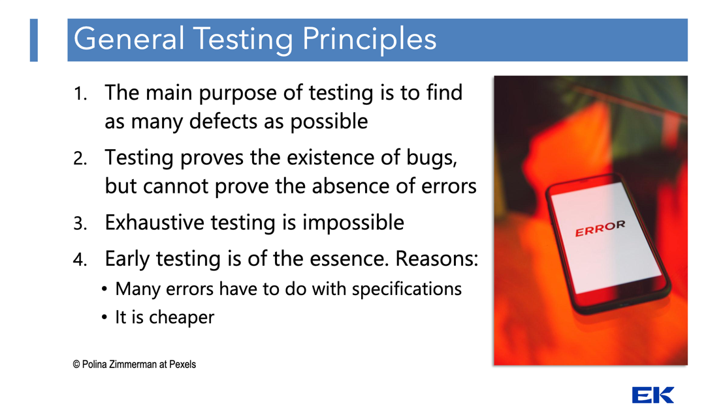

# Exam Notes

## Exam Questions

### Explain at least four general testing principles.

**1. Testing Shows the Presence of Defects, Not Their Absence**

Main goal of testing is to find failures and provide objective information about the quality of the software.

- **The Principle**: Testing can demonstrate that defects are present in the software, but it can never prove that the
  software is completely free of defects.
- **Implication**: Even after running all planned tests without finding a single bug, you can only state that the
  software
  behaved correctly under the conditions you tested. Testing is a risk-reduction strategy, not a guarantee of
  perfection.

**2. Early Testing Saves Time and Money**

The later a defect is discovered in the SDLC, the exponentially more expensive it is to fix.

- **The Principle**: Testing activities should be initiated as early as possible in the SDLC.

- **Implication**: Finding a flaw in the Requirements or Design phase (by reviewing documents) is significantly cheaper
  and easier to fix than finding it after the code has been written, integrated, and deployed to production. Early
  involvement of testing teams prevents costly rework.

**3. Exhaustive Testing is Impossible (100 % test coverage)**

Testing everything—all combinations of inputs, preconditions, and execution paths—is an impractical and often
unachievable goal for any non-trivial application.

- **The Principle**: Except for the most trivial applications, testing every possible scenario is mathematically
  impossible due to the sheer number of combinations.

- **Implication**: Testers must use risk analysis and prioritization to focus their efforts. Test the most critical,
  high-impact, or defect-prone areas of the software first, maximizing the chance of finding the most important bugs
  within the available time and resources.

**4. Defects Cluster Together**

Testing experience shows that the distribution of defects across a system is not uniform; instead, they tend to
accumulate in specific areas.

- **The Principle**: A small number of modules or components often contains the majority of the defects discovered
  during pre-release testing or is responsible for most of the operational failures. This is related to the Pareto
  Principle (80/20 Rule).

- **Implication**: Testers should use historical defect data, code complexity, and operational failure data to identify
  these defect clusters. Testing effort should be disproportionately focused on these high-risk areas to achieve the
  most efficient defect detection.

---
