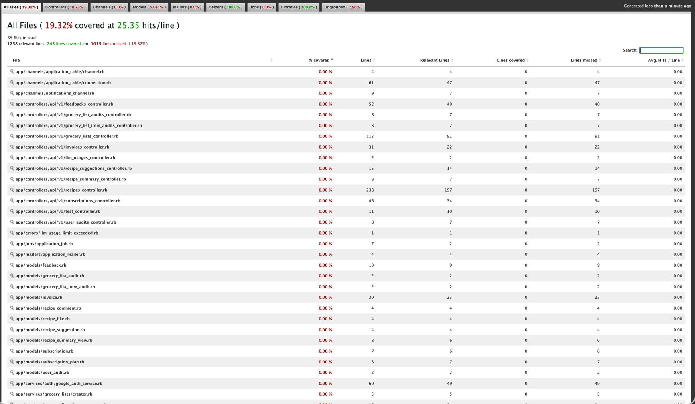

# Static Testing Tools and White-box test design

## Static Testing

### Rubocop

Linting and style enforcement. Rules are defined in `./server/.rubocop.yml`.

```
# analyze project
bundle exec rubocop

# Run analyzer and make rubocop automatically fix linting issues
bundle exec rubocop -a
```

**Successful rubocop:**

```bash
bundle exec rubocop
Inspecting 114 files
..................................................................................................................

114 files inspected, no offenses detected
.rubocop.yml: Style/SpaceInsideArrayLiteralBrackets has the wrong namespace - replace it with Layout/SpaceInsideArrayLiteralBrackets
```

**Linting errors highlighted by rubocop**

```bash
bundle exec rubocop
Inspecting 114 files
.....C............................................................................................................

Offenses:

app/controllers/api/v1/auth_controller.rb:10:19: C: [Correctable] Layout/SpaceInsideReferenceBrackets: Do not use space inside reference brackets.
    code = params[ :code ]
                  ^
app/controllers/api/v1/auth_controller.rb:10:25: C: Layout/SpaceInsideReferenceBrackets: Do not use space inside reference brackets.
    code = params[ :code ]
                        ^
app/controllers/api/v1/auth_controller.rb:18:19: C: [Correctable] Style/StringLiterals: Prefer single-quoted strings when you don't need string interpolation or special symbols.
      redirect_to "https://munchora.pro/home"
                  ^^^^^^^^^^^^^^^^^^^^^^^^^^^

114 files inspected, 3 offenses detected, 2 offenses autocorrectable
.rubocop.yml: Style/SpaceInsideArrayLiteralBrackets has the wrong namespace - replace it with Layout/SpaceInsideArrayLiteralBrackets
```

---

### SonarQube

[SonarQube](https://www.sonarsource.com/) a _static code analysis tool_ that automatically inspects code for bugs,
vulnerabilities, code smells, and test coverage without running the program.

[SonarQube can be run through the use of Docker](https://medium.com/@index23/start-sonarqube-server-and-run-analyses-locally-with-docker-4550eb7112a3)

```bash
cd ./server
docker-compose -f docker-compose-sonar-qube.yml up
```

Go to **SonarQube dashboard** on `http://localhost:9000` - default credentials are login: `admin` password: `admin`

Use following command to scan project with _SonnarScanner_:

```bash
docker run \
    --rm \
    -v "$(pwd):/usr/src" \
    --network="host" \
    -e SONAR_HOST_URL="http://localhost:9000" \
    -e SONAR_SCANNER_OPTS="-Dsonar.projectKey=server -Dsonar.sources=./ -Dsonar.test=test -Dsonar.javascript.lcov.reportPaths=test/coverage/lcov.info" \
    -e SONAR_TOKEN="${SONAR_TOKEN}" \
    sonarsource/sonar-scanner-cli
```

Sonarqube do also provide a cloud based solution which can be included in CI pipeline:


_The total test coverage is displayed, which is a bit low since the controllers will be tests by Postman/Newman CI
and not provided for SonarQube. Amount of Security Risks, Duplications, Reliability and Maintainability issues
are also displayed._


_Shows the same stats as previous image just a bit more explanatory_

<br>

---

## White Box Design Techniques

Focuses on the code and the structural elements.

---

**Statement Coverage**: Measures whether each line of code has been executed by the test suite at least once.
**decision coverage**: Measures whether **each decision (true/false outcome) of every conditional statement** has been
exercised at least once.

The code coverage is collected by _rspec_ and _simplecov_,
so whenever test command `bundle exec rspec` is executed a coverage report
is generated in JSON and HTML located at `./server/coverage/index.html` showing line-by-line coverage and totals.

Default _simplecov_ measures coverage by line coverage which can be an issue with ternary operator/one line conditionals
`number.odd? ? "odd" : "even"`

it can be set to use branch coverage instead:

```ruby
SimpleCov.start do
  enable_coverage :branch
end
```

The code coverage report is an excellent tool that helps you ensure tests are efficiently distributed throughout the
codebase. It does this by visually identifying uncovered lines and branches of logic.

Code coverage reports helps designing tests that validate not only the common "happy path",
but also critical edge cases and "negative paths"
(like error handling, exceptions, and the else block of an if statement)
where alternative parts of the system are executed.



### User creation | User #initialize

#### Test cases 100% statement coverage

```text
#1. first_name="John", last_name="Doe", email="john@doe.com", provider=nil, uid=nil, password="secret123"
    # TRUE path provider.blank? & TRUE :password is_a?(String)
    
#2. first_name="John", last_name="Doe", email="john@doe.com", provider="google", uid="abc123", password=nil
    # TRUE branch of both provider.present? and uid.present?
```

#### Test cases 100% decision coverage

```text
#1. first_name="John", last_name="Doe", email="john@doe.com", provider=nil, uid=nil, password="secret123"
    # TRUE path for provider.blank? and TRUE for :password is_a?(String)

#2. first_name="John", last_name="Doe", email="john@doe.com", provider=nil, uid=nil, password=1234
    # FALSE branch of :pasword is_a?(String)

#3. first_name="John", last_name="Doe", email="john@doe.com", provider="google", uid=nil, password=nil
    # FALSE branch of uid.present? when provider.present?

#3. first_name="John", last_name="Doe", email="john@doe.com", provider="google", uid="abc123", password=nil
    # TRUE branch of both provider.present? and uid.present?
```